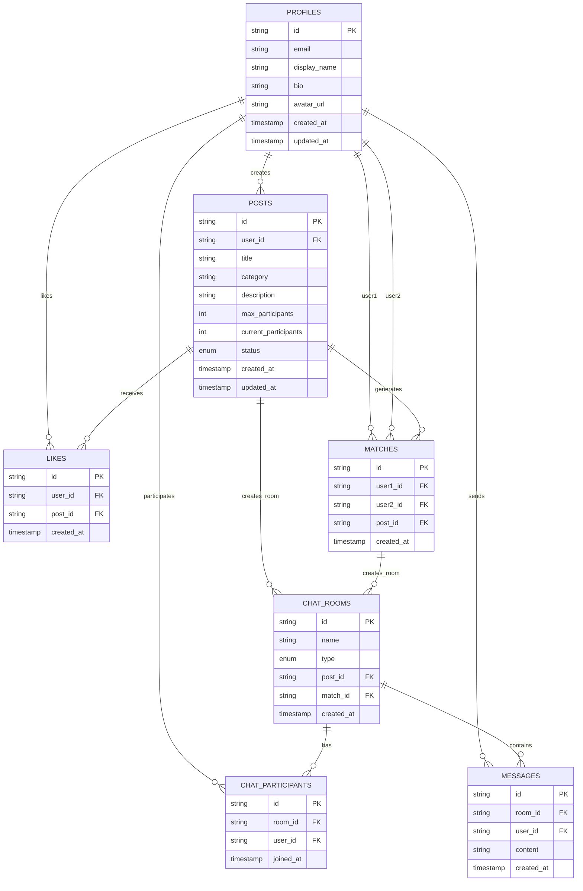

# Iverse2 データベース ER図

## ER図（Mermaid記法）

## テーブル詳細

### 1. PROFILES（ユーザープロフィール）
- **主キー**: `id` (string)
- **説明**: ユーザーの基本情報を格納
- **主要フィールド**:
  - `email`: メールアドレス
  - `display_name`: 表示名
  - `bio`: 自己紹介
  - `avatar_url`: アバター画像URL

### 2. POSTS（投稿）
- **主キー**: `id` (string)
- **外部キー**: `user_id` → PROFILES.id
- **説明**: ユーザーが作成した投稿を格納
- **主要フィールド**:
  - `title`: 投稿タイトル
  - `category`: カテゴリ
  - `description`: 投稿内容
  - `max_participants`: 最大参加者数
  - `current_participants`: 現在の参加者数
  - `status`: 投稿状態（draft/published/closed）

### 3. LIKES（いいね）
- **主キー**: `id` (string)
- **外部キー**: 
  - `user_id` → PROFILES.id
  - `post_id` → POSTS.id
- **説明**: ユーザーが投稿にいいねした記録

### 4. MATCHES（マッチング）
- **主キー**: `id` (string)
- **外部キー**: 
  - `user1_id` → PROFILES.id
  - `user2_id` → PROFILES.id
  - `post_id` → POSTS.id
- **説明**: ユーザー間のマッチング情報

### 5. CHAT_ROOMS（チャットルーム）
- **主キー**: `id` (string)
- **外部キー**: 
  - `post_id` → POSTS.id (nullable)
  - `match_id` → MATCHES.id (nullable)
- **説明**: チャットルームの基本情報
- **主要フィールド**:
  - `name`: ルーム名
  - `type`: ルームタイプ（match/project）

### 6. CHAT_PARTICIPANTS（チャット参加者）
- **主キー**: `id` (string)
- **外部キー**: 
  - `room_id` → CHAT_ROOMS.id
  - `user_id` → PROFILES.id
- **説明**: チャットルームの参加者情報

### 7. MESSAGES（メッセージ）
- **主キー**: `id` (string)
- **外部キー**: 
  - `room_id` → CHAT_ROOMS.id
  - `user_id` → PROFILES.id
- **説明**: チャットメッセージの内容
- **主要フィールド**:
  - `content`: メッセージ内容

## リレーションシップ概要

1. **1対多の関係**:
   - 1ユーザー → 複数投稿
   - 1ユーザー → 複数いいね
   - 1投稿 → 複数いいね
   - 1チャットルーム → 複数参加者
   - 1チャットルーム → 複数メッセージ

2. **多対多の関係**:
   - ユーザー ↔ ユーザー（マッチング）
   - ユーザー ↔ チャットルーム（参加者テーブル経由）

3. **オプショナル関係**:
   - チャットルームは投稿またはマッチングから作成可能
   - プロフィールの一部フィールドはnull許可

## ビジネスロジック

- **マッチング機能**: ユーザーが投稿にいいねすると、相互いいねでマッチング成立
- **チャット機能**: マッチング成立時または投稿参加時にチャットルームが自動作成
- **投稿管理**: 下書き→公開→終了の状態管理
- **参加者管理**: 投稿の参加者数をリアルタイムで管理
